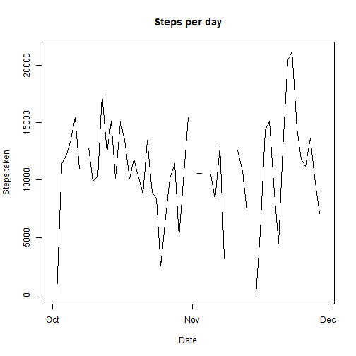
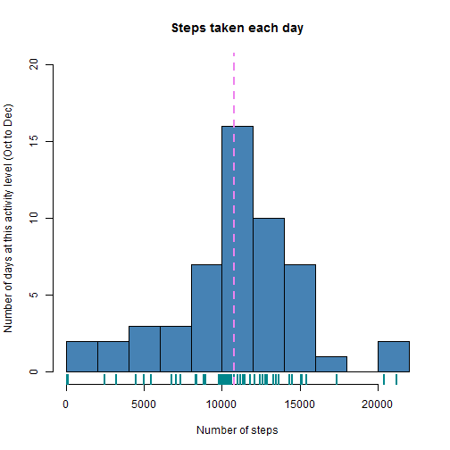
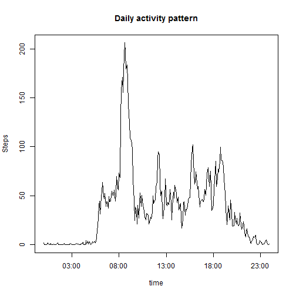
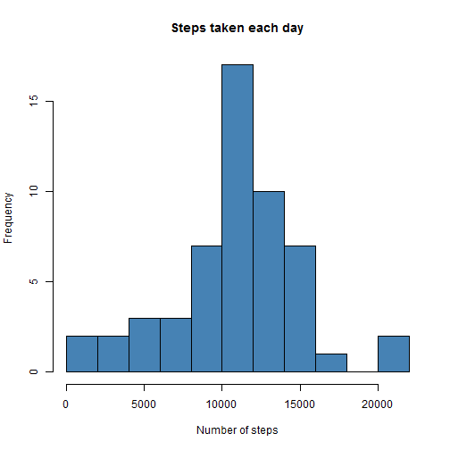
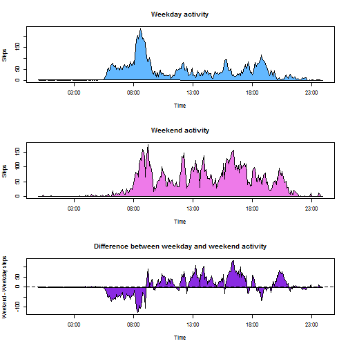

```r
library(knitr)
```
## Introduction

A natural consequence of computer miniaturization is the creation and adoption of "wearable device" technology.  Such wearable devices have experienced several generations of change:  they were originally bulky, independent gadgets that consumers had in their pocket, backpack, or clipped to a belt.  Second and third generation wearable tech involves placing computers and sensors in your cell phone, watch, or other accessory to gather large quantities of data about your actions and behavior.

This report summarizes the measured data, data processing strategy, and results of a personal activity monitoring device.  Each section attempts to answer slightly different questions and present novel ways of interpreting our personal activity.  Functions that were created for purposes of parsing or analyzing this data set are defined in the appendix.


## Loading and preprocessing the data

Personal activity data is loaded into R using a standard read.csv() function.  This personal device uses an unusual way of labeling time (13:55 is saved as as 155), which must be corrected for R to interpret it correctly.  We save the resulting aggregated as a two-vector data frame containing the five minute interval and the number of steps taken according to the device.


```r
loaddata <- function(){
    read.csv("C:\\Users\\Dianshi\\Desktop\\Laptop Stuff\\Reproducible research\\Peer Assessment 1\\activity.csv",
             stringsAsFactors = F, header = T)
}

as.datetime <- function(date = "", time = ""){
    newtime <- sprintf("%02d:%02d", floor(time / 100), time %% 100)
    datetimestr <- sprintf("%s %s", date, newtime)
    datetime <- strptime(datetimestr, format = "%Y-%m-%d %H:%M")
    datetime
}
```


```r
x <- loaddata() # raw data
y <- x
y$"datetime" <- as.datetime(x[,"date"], x[,"interval"]) # create as.posixct
y$"interval" <- as.POSIXct(sprintf("%02d:%02d", floor(y$"interval" / 100), y$"interval" %% 100), format = "%H:%M")
z            <- aggregate(y[,"steps"], by = (list(y[,"date"])), function(x) sum(x))
names(z)     <- c("date", "steps taken")
z[,"date"]   <- as.POSIXct(z[,"date"])
a            <- summary(z[,2])
dailymean    <- a[4]
dailymedian  <- a[3]
b            <- aggregate(y[["steps"]], 
                          by = list(y$"interval"),
                          function(x) mean(x, na.rm = T)) 
names(b)     <- c("interval", "steps")
```

## What is mean total number of steps taken per day?

It is helpful to first examine the lineplot of date vs. steps taken per day.  The following is a crude graph, but neatly illustrates a common issue with personal activity monitoring:  incomplete data  from poor compliance to always monitoring activity .  

```r
plot(z[,"date"], z[,"steps taken"], type = "l", xlab = "Date", ylab = "Steps taken", 
     main = "Steps per day") 
```

 

### Activity histogram
In the activity histogram, the mean number of steps (1.077 &times; 10<sup>4</sup>) is marked in purple, whereas the median number of steps (1.076 &times; 10<sup>4</sup>) is marked in the lighter violet color.  Their proximity suggests that the user of the device has a regular activity schedule, without enough extreme events skewing their average activity either up or down.

 

## What is the average daily activity pattern?

```r
highestActivityTime <- format(b[b$steps == max(b[,2]),"interval"], "%H:%M")
highestActivitySteps <- round(b[b$steps == max(b[,2]),"steps"])
```

We can average the number of steps taken at each time interval over the monitoring period to examine what the average daily activity appears as. In this case, the user appears to wake early in the morning and generates 206 steps at 08:35.  View the `Daily activity pattern` plot below.


```r
plot(b$interval, b$steps, type = 'l', xlab = "time", ylab = "Steps", main = "Daily activity pattern")
```

 


## Imputing missing values

### The number of missing values in the dataset


```r
c <- y
names(c) <- names(y)
numNA <- summary(c$steps)[7]
```

A quick examination of the data finds 2304 missing values (defined as `NA` in R).

### What kinds of strategies can be used to fill in missing data?

There are several interesting strategies that can be used to fill in missing data.  The strategy used here is to use the average number of steps at each time interval and replace the missing value with the average number of steps at that time.  A more sophisticated method could be to use the average number of steps on that day at that time or the same measurement on the previous or subsequent day.

### Creating new dataset with missing data filled in


```r
c[which(is.na(c$steps)), "steps"]<- b[b$interval == c[is.na(c$steps),"interval"], "steps"]
```
### Creating a histogram to visualize personal activity


```r
d <- aggregate(c[,"steps"], by = (list(c[,"date"])), function(x) sum(x))
names(d) <- c("interval", "steps")
hist(d[,2], main = "Steps taken each day", xlab = "Number of steps", 
     ylab = "Frequency", breaks = 10, col = 'steelblue')
```

 

```r
newMean <- summary(d[,"steps"])[4]
newMedian <- summary(d[,"steps"])[3]
```

After filling in missing data, the mean number of steps taken (after filling in mean values) is 1.077 &times; 10<sup>4</sup>, and the median number of steps taken is 1.077 &times; 10<sup>4</sup>.  Of course, filling in the missing values with mean measurements will not affect the mean, whereas the median is adjusted slightly in favor of the mean.  Ultimately, filling in missing values in this fashion, while satisfying, does not truly add information.  In fact, creating a daily activity pattern line plot to compare the two data sets does not reveal any visual differences between the data set with missing values and the data set with missing values imputed.


## Are there differences in activity patterns between weekdays and weekends?

This user enjoys sleeping in on the weekend, and is more active in the afternoons.

### Identifying weekdays and weekends

It is possible to label the day of the week using the weekdays() function on the date column.  Using the resulting `day` label, we can segregate the data into weekdays (Mon-Fri) and weekends (Sat-Sun).


```r
f <- c
f$day <- weekdays(as.Date(f$date))
fweekend <- f[f$day == "Saturday" | f$day == "Sunday", ]
fweekday <- f[!(f$day == "Saturday" | f$day == "Sunday"),]
fweekendactivity <- aggregate(fweekend$"steps", by = list(fweekend$"interval"), 
                              function(x) mean(x, na.rm = T)) 
fweekdayactivity <- aggregate(fweekday$"steps", by = list(fweekday$"interval"), 
                              function(x) mean(x, na.rm = T)) 
names(fweekdayactivity) <- c("interval", "steps")
names(fweekendactivity) <- c("interval", "steps")
diffweekendsteps <- fweekendactivity$steps - fweekdayactivity$steps
dailydiff <- c(fweekendactivity$interval, diffweekendsteps)
```

### Panel plot comparing weekdays to weekends


```r
par(mfrow = c(3,1))
plot(fweekdayactivity$interval, fweekdayactivity$steps, 
     type = 'n',
     xlab = 'Time',
     ylab = 'Steps',
     main = "Weekday activity")
polygon(fweekdayactivity$interval, fweekdayactivity$steps, col = 'steelblue1')
plot(fweekendactivity$interval, fweekendactivity$steps,
     type = 'n',
     xlab = 'Time',
     ylab = 'Steps',
     main = "Weekend activity")
polygon(fweekendactivity$interval, fweekendactivity$steps, col = 'orchid2')
plot(fweekdayactivity$interval, diffweekendsteps,
     type = 'n',
     xlab = 'Time', 
     ylab = 'Weekend - Weekday steps',
     main = 'Difference between weekday and weekend activity')
polygon(fweekdayactivity$interval, diffweekendsteps, col = 'blueviolet')
abline(0,0, col = 'black', lty = 2)
```

 
